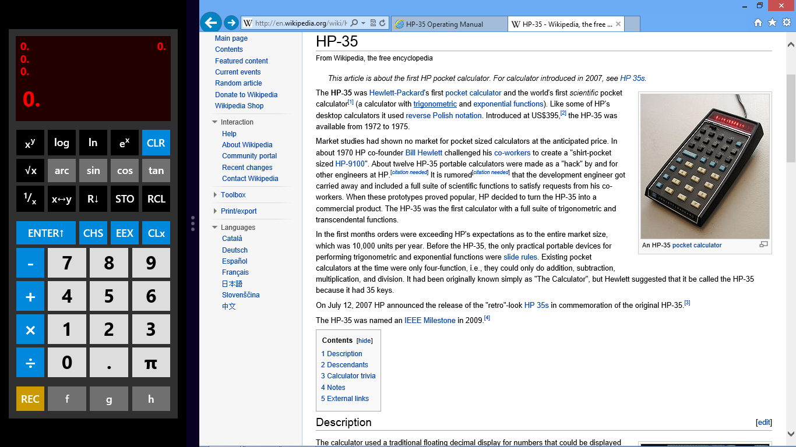

# RetroCalc

I love RPN calculators and collect HPs. I made [this app](http://apps.microsoft.com/windows/en-us/app/retrocalc/2a267e85-278b-48a0-ad10-b2d2028cf297) over a weekend some years ago when the Windows App Store first opened. I haven't touched it since! I figured I may as well put the source out there in case anyone wants to do anything with it.

It is essentially a GUI for the [HP-35 emulator I made at one point](http://blogs.msdn.com/b/ashleyf/archive/tags/hp_2d00_35/). It's an amazingly tiny F# "engine" running the original ROM from the 1972 device.

Have fun!
